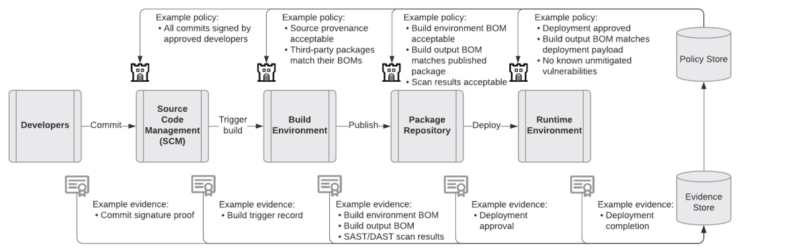

##  NOTE: The SCIM effort has a new name and location
- This site is now deprecated.
- Join us instead at https://github.com/ietf-scitt.

## Overview

The Supply Chain Integrity Model (SCIM) supports the ongoing verification of artifacts, including hardware and software components, where the authenticity of entities, evidence, policy, and artifacts can be assured and the actions of entities can be guaranteed to be authorized, non-repudiable, immutable, and auditable. The proposed SCIM will be an industry standard specification, easing the path for uniform data flow across globally distributed supply chains.

SCIM aligns with an iterative approach to developing and implementing supply chain integrity requirements, allowing for enhancements over time based on evolving threat models and practices. A phased roll out of requirements promotes clarity for supplier planning and engineering and minimize disruptions.

Note: SCIM describes principles and a proposed model and system for conveying evidence. It does not address what evidence or information for attestation of conformity must be conveyed.

## Workflow

The following diagram depicts the flow of artifacts, evidence and policies between entities in the Supply Chain Integrity Model. 

A Supplier creates an Artifact (a). An Attester creates Evidence (b) and submits to a Store for logging, query, and retrieval. The Supplier and Attester may be the same entity. A Policy Manager creates Policy (c) and submits to a Store where it is recorded and made available for query and retrieval. A User Agent receives an Artifact, retrieves Evidence and Policy, and verifies the Artifact (d). 

## Example Application

The diagram below shows an example application of SCIM to the Software Development Lifecycle (SDLC).

## Specifications

The table below maps proposed SCIM specifications to existing industry specifications.

SCIM | Existing
---- | --------
The SCIM-Evidence specification defines an extensible data model and exchange format for providing all types of evidence (bills of materials, build information, configuration settings, security assurances, certifications, vulnerabilities, end of life information) for all types of artifacts (hardware, software, services, machine learning models, etc.). | [SWID](https://nvd.nist.gov/products/swid), [SPDX](https://spdx.dev), [CycloneDX](https://cyclonedx.org), [in-toto](https://in-toto.io), [RATS](https://datatracker.ietf.org/doc/html/draft-ietf-rats-architecture-10), and others
The SCIM-Policy specification defines a data model and exchange format for providing policy for use in evaluating artifacts for a specified use. | [in-toto](https://in-toto.io), [RATS](https://datatracker.ietf.org/doc/html/draft-ietf-rats-architecture-10), and others
The SCIM-Store specification defines a rich, graph-aware storage API that allows read, write and query of Evidence and Policy. | [DBOM](https://dbom-project.readthedocs.io/en/latest), [Grafeas](https://grafeas.io), [RATS](https://datatracker.ietf.org/doc/html/draft-ietf-rats-architecture-10), [CCF](https://github.com/microsoft/ccf) and others

## Roadmap

- Phase 1
  - Organizations use existing tools and specifications to begin implementing [US Cyber EO](https://www.whitehouse.gov/briefing-room/presidential-actions/2021/05/12/executive-order-on-improving-the-nations-cybersecurity/) Section 4 requirements, including SBOMs.
  - SCIM community organized for the development of end-to-end standards.

- Phase 2
  - Organizations begin adopting SCIM specifications, which encompass and extend existing initiatives. 
  - SCIM specifications proposed to international standards bodies.

- Phase 3
  - SCIM specifications ratified by international standards bodies.
  - Widespread adoption of end-to-end model across globally distributed supply chains.

## Contributing

Community Meetings:
- SCIM community meetings are held each Monday at 8:05 AM Pacific. Email kayw@microsoft.com to be added to the meeting invitation.

Technical Meetings:
- SCIM technical meetings are held each Tuesday and Thursday at 8:00 AM Pacific. Email marieche@microsoft.com to be added to the meeting invitation.

Meeting Agenda and Minutes (both community and technical meetings):
- https://docs.google.com/document/d/1vf-EliXByhg5HZfgVbTqZhfaJFCmvMdQuZ4tC-Eq6wg/edit?usp=sharing

Meeting Videos (both community and technical meetings):
- https://www.youtube.com/playlist?list=PL6EgWS5xrcg4J3vYdv9SL8MyZMp14DxBv

SCIM Vision
- https://docs.google.com/document/d/1UnpSIVJuw3dha3twRCzzwgeyul9qKNoAhQ1whfzUto0/edit?usp=sharing
