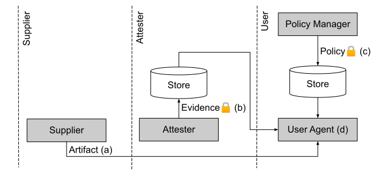

<!-- # Community Specification Template 1.0

Community Specifications are recommended to be drafted in accordance with international best practices.  Doing so provides clarity, helps adoption, and also eases the transition of this specification to other standards body if so desired.  Accordingly, the recommended template below is based on ISO standard drafting conventions.

To help you, this guide on writing standards was produced by the ISO/TMB and is available at https://www.iso.org/iso/how-to-write-standards.pdf.

A model manuscript of a draft International Standard (known as “The Rice Model”) is available at https://www.iso.org/iso/model_document-rice_model.pdf.

In addition, we recommend using the key words "MUST", "MUST NOT", "REQUIRED", "SHALL", "SHALL NOT", "SHOULD", "SHOULD NOT", "RECOMMENDED",  "MAY", and "OPTIONAL" as described in RFC 2119 -  https://tools.ietf.org/html/rfc2119 -->

 
## Supply Chain Integrity Model

### Version 1.0 PRE-DRAFT

<!-- ### Status (Pre-draft, Draft, Approved) -->

© The SCIM Maintainers

This specification is subject to the Community Specification License 1.0, available at [https://github.com/CommunitySpecification/1.0](https://github.com/CommunitySpecification/1.0).

 
## Contents

[Foreword](#Foreword)

[Introduction](#Introduction)

[1 Scope](#1%20%20%20Scope)

[2 Normative references](#2%20%20%20Normative%20references)

[3 Terms and definitions](#3%20%20%20Terms%20and%20definitions)

[4 Workflows](#4%20%20%20Workflows)

[4.1 Reference Use Cases](#4.1%20%20%20Reference%20Use%20Cases)

[5 Standards](#5%20%20%20Standards)

<!-- Annex A (informative)  

Bibliography 1 -->

## Foreword

Attention is drawn to the possibility that some of the elements of this document may be the subject of patent rights. No party shall not be held responsible for identifying any or all such patent rights.

Any trade name used in this document is information given for the convenience of users and does not constitute an endorsement.

This document was prepared by the SCIM maintainers.

<!-- This second/third/… edition cancels and replaces the first/second/… edition (#####:####), which has been technically revised.
The main changes compared to the previous edition are as follows:
— xxx xxxxxxx xxx xxxx -->

Known patent licensing exclusions are available in the specification’s repository’s Notices.md file.

Any feedback or questions on this document should be directed to specifications repository, located at [https://github.com/microsoft/scim](https://github.com/microsoft/scim).

THESE MATERIALS ARE PROVIDED “AS IS.” The Contributors and Licensees expressly disclaim any warranties (express, implied, or otherwise), including implied warranties of merchantability, non-infringement, fitness for a particular purpose, or title, related to the materials.  The entire risk as to implementing or otherwise using the materials is assumed by the implementer and user. IN NO EVENT WILL THE CONTRIBUTORS OR LICENSEES BE LIABLE TO ANY OTHER PARTY FOR LOST PROFITS OR ANY FORM OF INDIRECT, SPECIAL, INCIDENTAL, OR CONSEQUENTIAL DAMAGES OF ANY CHARACTER FROM ANY CAUSES OF ACTION OF ANY KIND WITH RESPECT TO THIS DELIVERABLE OR ITS GOVERNING AGREEMENT, WHETHER BASED ON BREACH OF CONTRACT, TORT (INCLUDING NEGLIGENCE), OR OTHERWISE, AND WHETHER OR NOT THE OTHER MEMBER HAS BEEN ADVISED OF THE POSSIBILITY OF SUCH DAMAGE.

## Introduction
In the exchange of artifacts across a supply chain, it is often the case that receiving entities require evidence in order to verify the suitability of an artifact for an intended use. Such verification requires evaluating evidence against requirements. Requirements are typically defined by policy manager entities.

Because evidence about artifacts can change over time, for example defects may be identified, artifacts may reach end-of-life status, and suppliers may go out of business, receiving entities must continuously verify evidence and respond to changes. 

At each step in the supply chain, careless or malicious parties may perform actions that diminish artifact integrity. To uphold integrity, policy manager entities must be able to enforce that all entities, artifacts, evidence and policy in the supply chain are authentic. Additionally they must be able to enforce that all actions are authorized, transparent, immutable and auditable.

This specification describes a model for the exchange of evidence and policy to support the ongoing verification of artifacts where the authenticity of entities, evidence, policy and artifacts can be assured and the actions of entities can be guaranteed to be authorized, transparent, immutable and auditable.

 
## Supply Chain Integrity Model - Workflows and Standards
### 1&nbsp;&nbsp;&nbsp;Scope

The Supply Chain Integrity Model (SCIM) specifies an end-to-end system for validating arbitrary artifacts in terms of supply chains whose integrity has been proven.

SCIM is applicable to both hardware (objects in the physical world) and software (digital) artifacts.

SCIM defines minimum standards around the preparation, storage, distribution, consumption, validation and evaluation of arbitrary evidence about artifacts that are critical to maintaining the integrity of supply chains.

SCIM does not define how artifacts are produced or distributed, nor the methods by which evidence about artifacts is produced prior to preparation for inclusion in SCIM.

### 2&nbsp;&nbsp;&nbsp;Normative references

<!-- Two options of text (remove the inappropriate option).

1) The normative references shall be introduced by the following wording.

The following documents are referred to in the text in such a way that some or all of their content constitutes requirements of this document. For dated references, only the edition cited applies. For undated references, the latest edition of the referenced document (including any amendments) applies.

ISO ##### #, General title — Part #: Title of part

ISO ##### ##:20##, General title — Part ##: Title of part

2) If no references exist, include the following phrase below the clause title: -->
There are no normative references in this document.

### 3&nbsp;&nbsp;&nbsp;Terms and definitions

For the purposes of this document, the following terms and definitions apply.

ISO and IEC maintain terminological databases for use in standardization at the following addresses:

— ISO Online browsing platform: available at https://www.iso.org/obp

— IEC Electropedia: available at http://www.electropedia.org/

#### 3.1

**Artifact**

An item exchanged in a supply chain. Examples of Artifacts include hardware components, software components, IoT devices, cloud service endpoints, consumer products and data.

#### 3.2

**Evidence**

Believable information about an Artifact. At a minimum, Evidence includes supplier and artifact identity. Evidence may also include the results of evaluations such as security scans, regulatory audits, quality test suites, and notices of product defects, vulnerabilities, and end of support.

#### 3.3

**Policy**

A set of rules that informs how a User Agent uses Evidence to verify the suitability of an Artifact for an intended use.

#### 3.4

**Supplier**

An entity that provides an Artifact. 

#### 3.5

**Attester**

An entity that provides Evidence about an Artifact.

#### 3.6

**Policy Manager**

An entity that provides Policy for verifying Artifacts using Evidence.

#### 3.7

**User Agent**

An entity that uses Evidence to verify Artifacts against Policy.

#### 3.8

**Store**

A data store that enables the storage, query, subscription and retrieval of certified Evidence and Policy by authorized Users.

### 4&nbsp;&nbsp;&nbsp;Workflows

The Supply Chain Integrity Model (SCIM) describes a set of specifications enabling one or more entities ("Attesters") to produce believable information ("Evidence") about an item in the supply chain ("Artifact"). Attesters submit Evidence to a web service ("Evidence Store") where it is certified and made available to receiving entities ("User Agents"). The Evidence enables other entities ("User Agents") to verify whether the Artifact conforms to management policies ("Policy").

The diagram depicts the flow of artifacts between entities in the Supply Chain Integrity Workflow.

   
  Figure 4.1 -- Supply Chain Integrity Model Workflow

A Supplier creates an Artifact (a) and an Attester creates Evidence (b) about an Artifact. The Supplier and the Attester may be the same entity. The Attester submits Evidence to a Store where it is certified and made available for query and retrieval.

A Policy Manager creates Policy (c) and submits it to a Store where it is certified and made available for query and retrieval.

A User Agent (d) receives an Artifact, and retrieves Evidence and Policy. The User Agent uses Evidence to verify the Artifact against Policy.

#### 4.1&nbsp;&nbsp;&nbsp;Reference Use Cases

This section covers a number of representative use cases for supply chain integrity, independent of specific solutions. The purpose is to provide motivation for various aspects of the architecture presented in this document. Many other use cases exist, and this document does not intend to have a complete list, only to have a set of use cases that collectively cover all the functionality required in the architecture.

Each use case includes a description followed by a summary of the Attester and Relying Party roles.

#### 4.1.1&nbsp;&nbsp;&nbsp;Self-Attestation

In the most basic use case for supply chain integrity, a Supplier serves a dual role as Supplier and Attester, providing Evidence about an Artifact. At a minimum, Evidence includes globally unique identities for both the Supplier and the Artifact. Evidence may include additional information such as the following:

- information allowing the Artifact to be verified (e.g. a cryptographic hash for software)
- information about subcomponents of the Artifact
- information about how the Artifact was created
- information about restrictions on the legal use of the Artifact
- information about security and quality evaluations performed on the Artifact
- information about defects identified in the Artifact
- references to related Artifacts or Evidence

A Supplier creates an Artifact (a) and Evidence (b). A Policy Manager provides Policy (c). A User Agent (d) obtains Artifact (a) and Evidence (b), and uses Policy (c) to verify suitability of Artifact (a) for the intended use.

   
  Figure 4.1.1.1 -- Self-Attestation Workflow

#### 4.1.2&nbsp;&nbsp;&nbsp;Private/Public Attestation

In this use case, a Supplier creates an Artifact (a), private Evidence (b), and private Policy (c). A Build Verifier (d) uses these to verify Artifact (A) prior to release. At release, the Supplier provides a summarized version of Evidence (e) for public users.

   
  Figure 4.1.2.1 -- Private/Public Attestation Workflow

On the User side, a Policy Manager creates Policy (f), and a User Agent (g) obtains Artifact (a) and uses Policy (f) to verify suitability of Artifact (a) for the intended use. 

#### 4.1.3&nbsp;&nbsp;&nbsp;Multi-Party Attestation

To increase trust in Artifacts, Policy Managers may require independent Evidence from multiple third-party Attesters. For example in a software supply chain, a Policy Manager may require that all code commits be approved by two qualified reviewers, or that software be independently rebuilt by multiple parties with matching build Artifacts.

In the Multi-Party Attestation workflow, the User Agent obtains an Artifact from the Supplier and Evidence (a) and (b) from Attesters.The User Agent verifies the Artifact against Policy, which specifies allowed Attesters, the number of Attesters required, and any additional requirements.

   
  Figure 4.1.3.1 -- Multi-Party Attestation Workflow

#### 4.1.4&nbsp;&nbsp;&nbsp;Subcomponent Verification

Often a Policy Manager requires that a final component (Artifact) and all sub-components (Artifacts) conform to Policy, for example that a component and all subcomponents are free from critical defects.

In this workflow, Subcomponent Suppliers provide Artifacts (a) and (b) and Evidence (a) and (b) to the Component Supplier, who in turn provides Artifact (c) and Evidence (c) to the User Agent. Evidence (c) includes Evidence (a) and (b) either inline, or by reference. The User Agent verifies Artifact (c) against Policy, which specifies requirements for the component and all nested subcomponents.

   
  Figure 4.1.4.1 -- Subcomponent Verification Workflow

#### 4.1.5&nbsp;&nbsp;&nbsp;Continuous Verification

Policy Managers often require corrective action when changes occur in Artifact status, such as when critical security issues are reported, when legal licences are modified, and when Artifacts become obsolete. Additionally, Policy Managers may require corrective action when changes occur in Policy, for example to respond to updated business or regulatory requirements. Thus, User Agents must continuously monitor and respond to changes in both Evidence and Policy. In some cases, such as the case of critical security issues, the response must be rapid.

In this workflow, the User Agent obtains Evidence (a) and Policy (a) and uses these to verify an Artifact.

Later, when a critical security issue is reported against the Artifact by a Defect Reporting Service, the User Agent receives Evidence (b) and re-verifies the artifact, rapidly performing corrective action.

Later still, business conditions require the Policy Manager to modify policy. At this time, the User Agent receives Policy (b) and re-verifies the Artifact, performing corrective action as needed.

Eventually, when the Supplier determines to discontinue support for the Artifact, it provides new evidence, Evidence (c) indicating the Artifact’s pending obsolescence. The user receives the new evidence, re-verifies the Artifact, and performs corrective action as needed.

   
  Figure 4.1.5.1 -- Continuous Verification Workflow

#### 4.1.6&nbsp;&nbsp;&nbsp;Runtime Integrity Verification

Policy Managers often require verification that Artifacts are not tampered with after deployment to production environments..

The diagram below depicts a workflow in which software is received from a Supplier, verified and installed by an Installer, and monitored for runtime tampering by a Runtime Monitor. 

Initially, the Installer obtains the Artifact and Evidence and uses the evidence, in this case a cryptographic hash of the Artifact, to verify Artifact integrity prior to installation. Post installation, the Installer submits new Evidence, including a cryptographic hash for each installed file, to a local Evidence Store.

Thereafter, a Runtime Monitor such as a background process or application loader continuously verifies installed files against the Evidence (cryptographic hashes) in the local Evidence Store.

   
  Figure 4.1.6.1 -- Runtime Integrity Verification Workflow

### 5&nbsp;&nbsp;&nbsp;Standards

The diagram below shows standards that comprise the Supply Chain Integrity Model.

   
  Figure 5.1 -- Standards within the Supply Chain Integrity Model

**SCIM-Evidence**. The SCIM-Evidence standard defines a data model and exchange format for providing evidence about artifacts.  Add requirements for SCIM-Evidence standard.

**SCIM-Policy**. The SCIM-Policy standard defines a data model and exchange format for providing policy for use in evaluating artifacts for a specified.use.

**SCIM-Store**. The SCIM-Store standard provides a definition for a service that allows publishing and subscribing to Evidence and Policy. The Data Store provides backing storage for both Evidence and Policy. The Data Store service definition provides a uniform application programming model that allows:
- Distributed identity management.
- Verification and certification of published evidence and policy.
- Transparent, immutable, non-repudiable logging of transactions.
- Rich, graph-aware query of evidence and policy.
- Notifications of new transactions in the data store (to support continuous verification)

<!-- ## Annex A

(informative)

Annex title e.g. Example of a figure and a table

A.1 Clause title autonumber

Use subclauses if required e.g. A.1.1 or A.1.1.1. For example:

A.1.1 Subclause autonumber

A.1.1.1 Subclause autonumber

Type text.

Dimensions in millimetres

## Bibliography

[1] ISO ##### #, General title — Part #: Title of part

[2] ISO ##### ##:20##, General title — Part ##: Title of part -->
